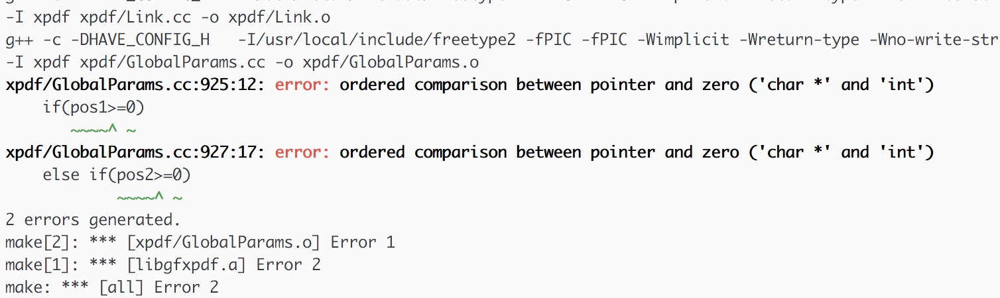
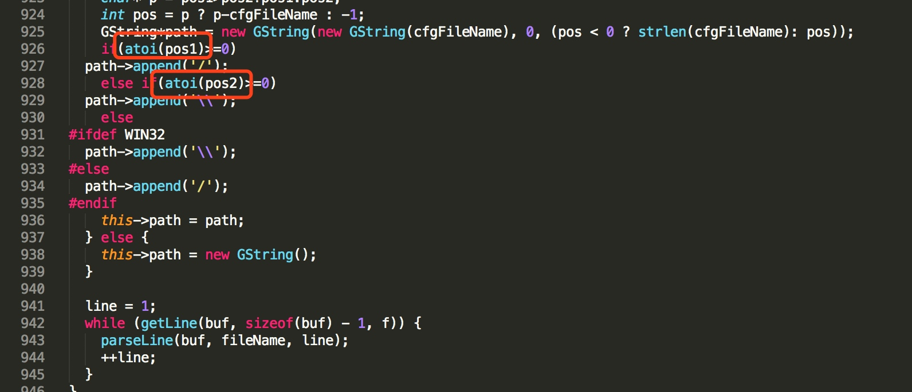
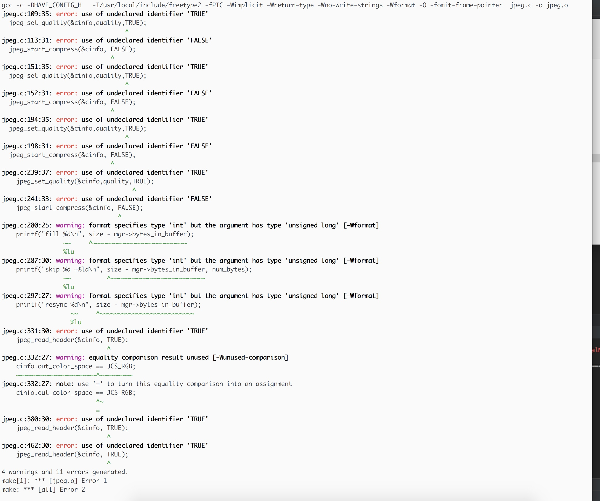
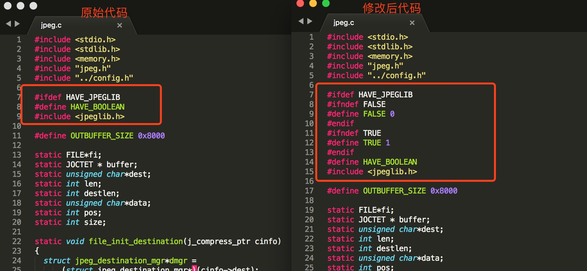
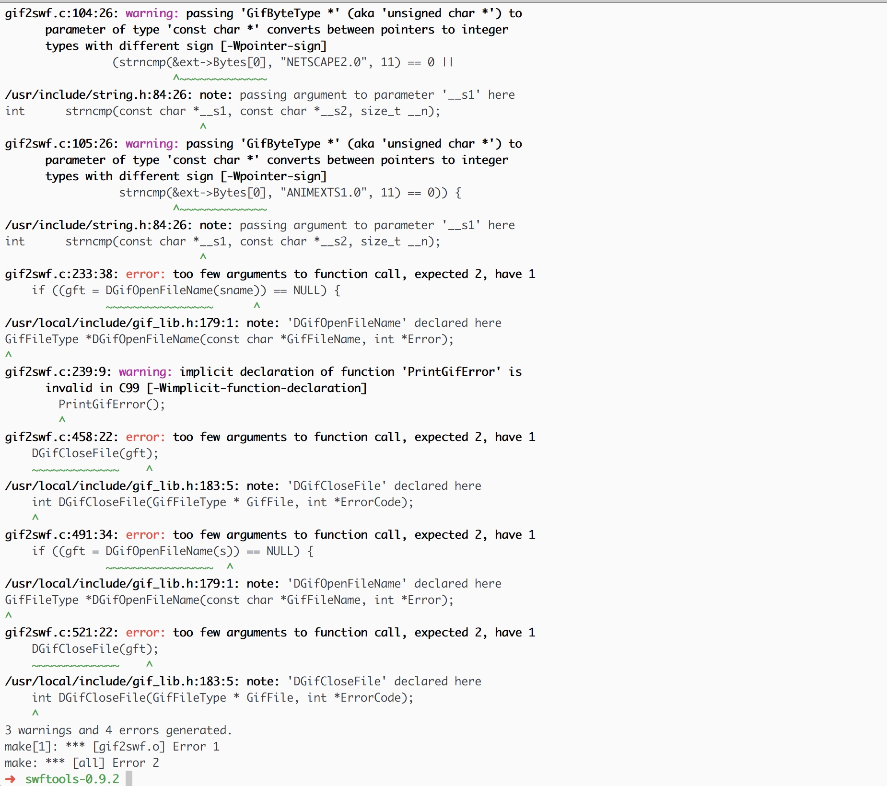
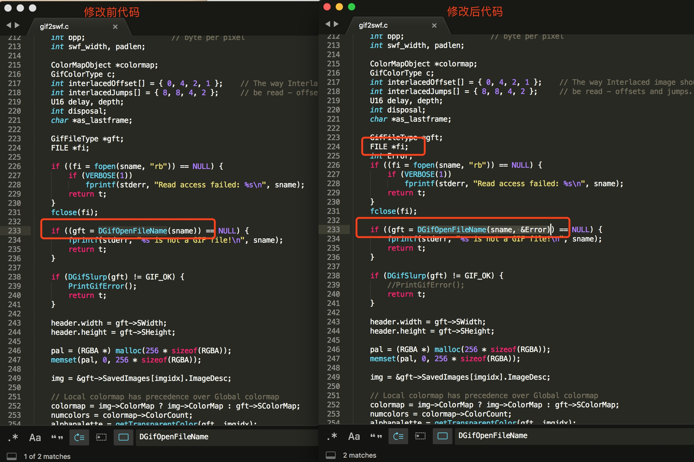

# Mac编译安装swfTools
[TOC]

## 下载源码
这里下载安装的是`swftools-0.9.2.tar.gz`，具体的地址为：`http://www.swftools.org/swftools-0.9.2.tar.gz`
[swftools-0.9.2.ta](media/swftools-0.9.2.tar.gz)
## 解压源码
## 安装依赖项  

```shell
# Linux/CentOS 安装 这里没有实际测试，需要自己去测试 这里只是一个记录
yum install gcc* automake zlib-devel libjpeg-devel giflib-devel freetype-devel
```

主要通过brew安装一下四个包：lzlib、giflib、jpeg、freetype   
Mac版本安装命令：
   
```shell
# 注意 lzlib 也许是不需要安装的，这里没有去测试
brew install lzlib
brew install giflib
brew install jpeg
brew freetype
```

## `./configure`执行配置或者执行如下配置命令:  
    
```shell
sudo LDFLAGS="-L/usr/local/lib" CPPFLAGS="-I/usr/local/include" ./configure  --prefix=/usr/local/swftools
```
## 需要注意这里存在部分代码错误，需要修改解决后执行
###  一、char * 和 int比较导致的错误， 需要修为文件 
错误信息：


> 在`swftools-0.9.2/lib/pdf/xpdf/GlobalParams.cc`文件中修改

 1 插入文件头 
    `#include <stdlib.h>`
 2 错误处理代码
（具体修改位置可以参考错误提示），原始代码是直接使用变量做比较，这里需要对变量调用`atio`函数后比较

### 二、存在一些变量没有定义的错误
错误信息：


文件`swftools-0.9.2/lib/jpeg.c`中存在部分变量没有定义，这里需要修改

修改后代码：

```c
//修改后代码
#ifdef HAVE_JPEGLIB
#ifndef FALSE 
#define FALSE 0 
#endif
#ifndef TRUE
#define TRUE 1
#endif
#define HAVE_BOOLEAN
#include <jpeglib.h>
```

### 三、存在一些方法参数数量错误 以及 部分函数没有定义问题
 报错信息：

解决方案：
> 修改文件`swftools-0.9.2/src/gif2swf.c`等内容：
   
 1.1 全局搜索`DGifOpenFileName`和`DGifCloseFile`调用   
 1.2 在存在调用上述两个方法的地方，定义变量    
        ```c
        int Error;
        ```
        并且修改调用为：
        ```c
        DGifOpenFileName(sname, &Error)
        ```
        
> 注意：这里修改需要注意，如果上述两个方法在同一个方法中调用，只需定义一次变量即可   

 1.3 在当前文件中全局搜索`PrintGifError();`，将这行代码删除或注释掉。       
## `make`编译
## `make install`安装

## 开发注意点

### 关于pdf2swf转码命令：  

```shell
pdf2swf  -t "/Users/zhangxiong/project/qware/wbiot/mus/MS-FS-Server/tempFile/5bd8f9d8-185d-4d7b-9be8-1658441f784f.pdf" -o  "/Users/zhangxiong/project/qware/wbiot/mus/MS-FS-Server/tempFile/877a9f8d-dd7e-46a2-b431-cadd0ff36e44.swf" -s flashversion=9 -s languagedir=/Users/zhangxiong/devtools/xpdf/xpdf-chinese-simplified 
```

> 注意：如果是在Java的命令行执行转码，文件路径和生成的路径不能加双引号，也就是以为这文件源路径和目标路径不能有空格

### Java代码调用执行文档转换代码：
> 注意：如果是在Java的命令行执行转码，文件路径和生成的路径不能加双引号，也就是以为这文件源路径和目标路径不能有空格

```java
package cn;

import java.io.*;

/**
 * 将pdf转化为swf文件
 *  需要工具 swftools -> pdf2swf
 *
 * @author 
 *
 */
public class Pdf2swfUtil {
    // pdf2swf 执行文件路径
	private static String pdftoswf = "devtools/swftools-0.9.2/src/pdf2swf";
	/** 
	 * @param sourcePath  pdf原路径
	 * @param destPath    目的路径
	 * @param fileName    生成swf的文件名
	 */
    public static int convertPDF2SWF(String sourcePath, String destPath, String fileName) throws Exception {  
        //目标路径不存在则建立目标路径  
        File dest = new File(destPath);  
        if (!dest.exists()) dest.mkdirs();  
          
        //源文件不存在则返回  
        File source = new File(sourcePath);  
        if (!source.exists()) return 0;  
          
        //调用pdf2swf命令进行转换
        // 注意 这里的文档输入和文档输出路径不能存在空格， 并且这里的命令中，路径不能使用双引号包住
        String command = pdftoswf + " -o " + destPath + fileName + "  -s flashversion=9 " + sourcePath + "";

        System.out.println(command);
        Process pro = Runtime.getRuntime().exec(command);

        final InputStream is1 = pro.getInputStream();
        new Thread(new Runnable() {
            public void run() {
                BufferedReader br = new BufferedReader(
                        new InputStreamReader(is1));
                StringBuffer sb = new StringBuffer(" ====================>>> \n");
                try {
                    String line = null;
                    while ((line = br.readLine()) != null) {
                        sb.append(line);
                    }
                    sb.append(" <<<<<<<========================================");
                    System.out.println(sb.toString());
                } catch (IOException e) {
                    e.printStackTrace();
                }
            }
        }).start(); // 启动单独的线程来清空process.getInputStream()的缓冲区

        final InputStream is2 = pro.getErrorStream();
        new Thread(new Runnable() {
            public void run() {
                BufferedReader br = new BufferedReader(
                        new InputStreamReader(is2));
                StringBuffer sb = new StringBuffer(" ====================>>> \n");
                try {
                    String line = null;
                    while ((line = br.readLine()) != null) {
                        sb.append(line);
                    }
                    sb.append(" <<<<<<<========================================");
                    System.out.println(sb.toString());
                } catch (IOException e) {
                    e.printStackTrace();
                }
            }
        }).start(); // 启动单独的线程来清空process.getInputStream()的缓冲区
        try {  
            pro.waitFor();  
        } catch (InterruptedException e) {  
            // TODO Auto-generated catch block  
            e.printStackTrace();  
        }  
          
        return pro.exitValue();
          
    }  
      
    public static void main(String []args) throws Exception {
        // TODO: 2018/5/24 这里需要确定自己文档的路径和输出路径
        String sourcePath = "Downloads/编写高质量代码--Web前端开发修炼之道.pdf";
        String destPath = "project/qware/refactor/";
        String fileName = "test.swf";  
        Converter.convertPDF2SWF(sourcePath, destPath, fileName);
        File file = new File(destPath + fileName);
        if (!file.exists()) {
            throw new RuntimeException("not create file ");
        }
    }  
}  
```


